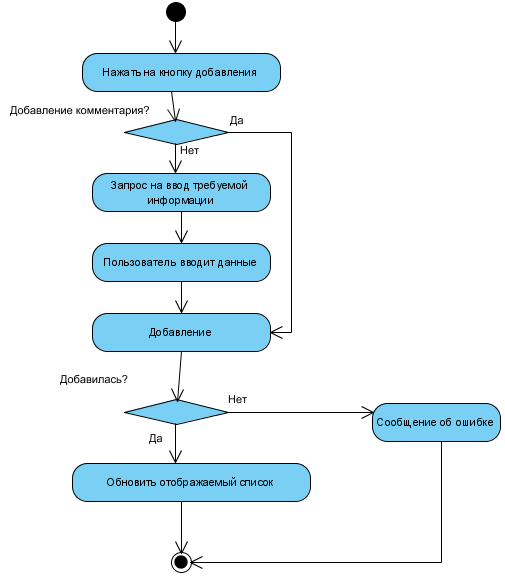
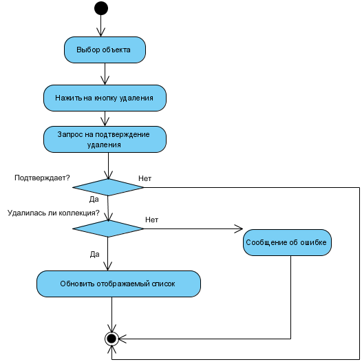

### Добавить объект

Цель: Добавить новый объект  

Включает:
- добавление коллекций;
- добавление документов;
- добавление комментариев (пометок).

Главная последовательность:  
1. пользователь нажимает на кнопку добавления объекта;
2. если это операция добвления комментария, то переход к пункту 4;
3. система запрашивает у пользователя информацию о новом объекте;
4. пользователь вводит требуемое;
5. система пытается добавить объект. Если ошибка - переход к альтернативной последовательности A1;
6. новая коллекция отображается вместе с остальными.

Альтернативная последовательность А1:  
1. система выдаёт сообщение о произошедшей ошибке.

### Удалить объект

Цель: Удалить существующий объект   

Включает:
- удаление коллекций;
- удаление документов;
- удаление комментариев (пометок). 

Предусловие: 
- объект должен существовать.

Главная последовательность:  
1. пользователь нажимает на кнопку удаления объекта;
2. система запрашивает у пользователя подтверждение;
3. пользователь подтверждает действие. При отмене действия переход к альтернативной последовательности A1;
4. система удаляет объект.

Альтернативная последовательность А1:  
1. система не удаляет объект;

### Просмотреть

Цель: Отобразить в центральной части окна содержание коллекции, т.е. список входящих в неё документов и краткую информацию о них. Либо отобразить подробную информацию я выбранном документе

Включает:
- просмотр содержимого коллекции;
- просмотр информации о документе.  

Предусловие: 
- объект должен существовать.

Главная последовательность:  
1. пользователь выбирает нужный объект;
2. система отображает информацию об объекте.

### Открыть документ средствами операционной системы

Цель: Открыть выбранный для просмотра/редактирования

Предусловие:
- коллекция должна быть выбрана.

Главная последовательность:
1. пользователь выбирает требуемый документ;
2. система передаёт путь к документу средствами операционной системы;
3. поиск реального документа на персональном компьютере. Если не найден, то переход к альтернативной последовательности А1;
4. открытие документа.

Альтернативная последовательность А1:  
1. система выдаёт сообщение, что документ не найден.

### Поиск

Цель: Нахождение документов или коллекций по названию  

Включает:
- поиск по документам;
- поиск по коллекциям.  

Главная последовательность:
1. пользователь вводит информацию для поиска;
2. система ищет совпадения в базе данных;
3. система отображает результат.

### Изменить информацию об объекте

Цель: Изменение существующей информации о конкретном документе. Или изменение конкретного комментария

Включает:
- изменение комментариев (пометок);
- изменение информации о документе.  

Предусловие:
- документ должн быть выбран.

Главная последовательность:
1. выбрать объект;
2. нажать кнопку редактирования;
3. пользователь изменяет необходимую информацию;
4. система сохраняет изменение.

