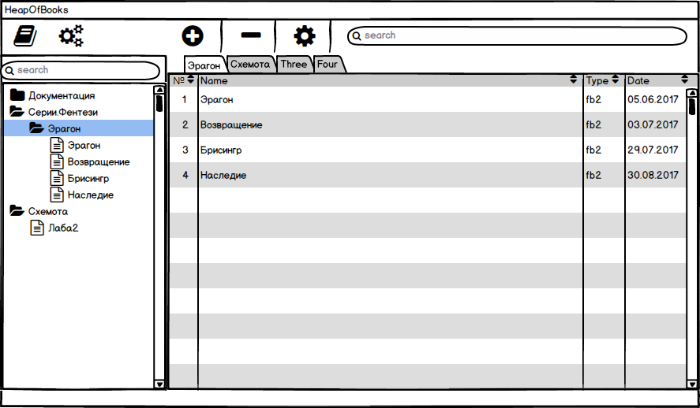
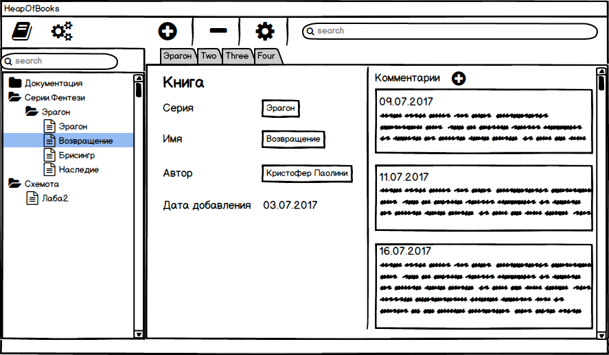
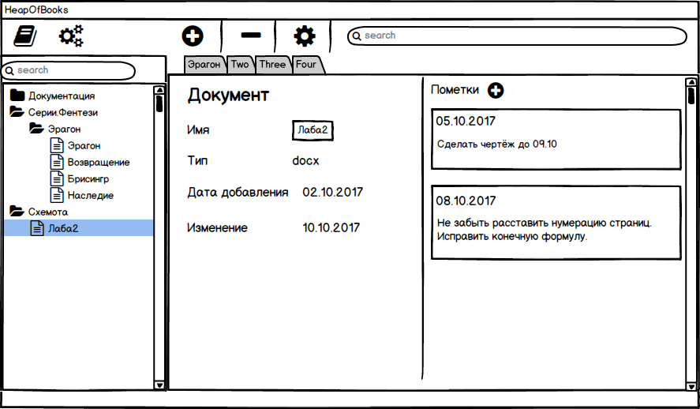

# **Требования к проекту**

## **1 Введение**

Название проекта: **HeapOfBooks**.  
Цель данного проекта — систематизация текстовых документов в пределах одного персонального компьютера.

Пользователю будут доступны следующие функции:
- создание пользовательских коллекций документов;
- добавление, удаление текстовых документов в коллекциях;
- изменение информации о текстовых документах;
- поиск по категориям;
- открытие текстовых документов из приложения;
- возможность добавления пользовательских рецензий к текстовым документам.

## **2 Требования пользователя**

### **2.1 Программные интерфейсы**

Windows  Presentation  Foundation(WPF) технология для построения клиентских приложений Windows:

- язык разметки XAML для построения графической части проекта;
- платформа .NET, C# для разработки логики проекта;
- MySQL для хранения информации о коллекциях книг.
### **2.2 Интерфейс пользователя**

Вид экрана при запуске приложения. Выбор конкретной коллекции. Закладки выбранных коллекций. Содержание коллекции.  

Подробная информация о выбранной книге. Пользовательские комментарии о книге.   

Подробная информация о выбранном файле. Пользовательские пометки к файлу.   

### **2.3 Характеристики пользователей**

Данное приложение рассчитано на широкий круг пользователей и не имеет возрастного ограничения. Предполагается, что данный продукт будет использоваться людьми, заинтересованными в систематизации необходимых им текстовых документов и комфортной работе с ними, а также создании личной электронной библиотеки.   
Минимальные необходимые навыки - умение пользоваться персональным компьютером на базовом уровне и опыт работы с программными продуктами.

## **3 Системные требования**

Для запуска данного приложения (WPF приложения) на персональном компьютере требуется, чтобы было предустановлено следующие программное обеспечение:

- Windows XP с пакетом обновления 2 или выше;
- Платформа .NET Framework 3.0 или выше.
## **3.1 Функциональные требования**

3.1.1 Верхняя панель иконок (слева направо):  
- иконка "Книга" - создание новой коллекции;
- иконка "Общие настройки" - общие настройки всего приложения;
- иконка "Плюс" - добавление текстового документа в выбранную (открытую во вкладке) коллекцию;
- иконка "Минус" - удаление выбранного текстового документа из коллекции;
- иконка "Настройки" - открыть окно информации в соответствии с типом текстового документа (книга/документ);
- поиск текстовых документов по названию.

3.1.2 Левая панель с древовидной структурой коллекций:
- поиск коллекций;
- структура коллекций, представленная в виде дерева.

3.3.3 Центральное окно:
- вывод содержания выбранной коллекции в виде таблицы.
- выбранные коллекции представляются вкладками главного окта;
- сортировка по столбцам таблицы.

3.3.4 Информация о книге:
- редактирование данных о книге;
- добавление пользовательских комментариев о книге.

3.3.5 Информация о документе:
- редактирование данных о книге;
- добавление пользовательских пометок.

## **3.2 Нефункциональные требования**
##### **3.2.1 Атрибуты качества**

**Требования по удобству использования**:
- Приложение должно позволять клиенту открыть необходимый текстовый документ системными средствами в одну операцию;
- Приложение должно позволять клиенту создать новую коллекцию в одну операцию.

**Требования к безопасности**:
- Приложение не должно ограничивать доступ пользователя к текстовым документам в пределах его персонального компьютера.
